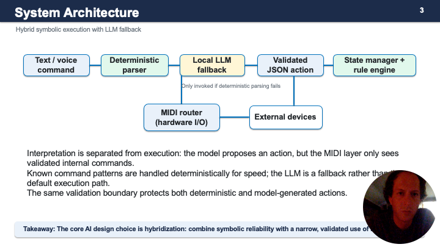
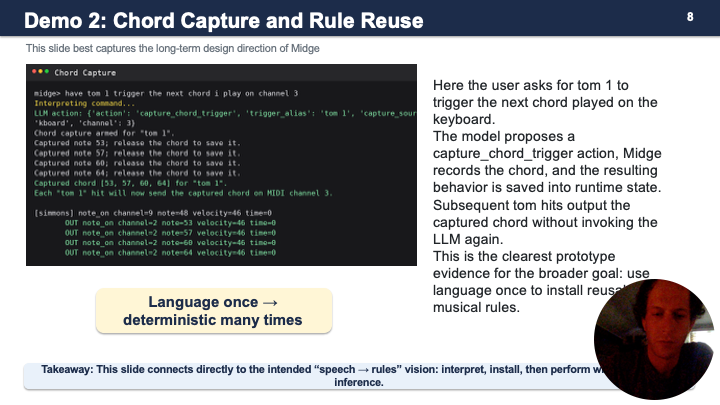

# Midge

> A hybrid deterministic + language-model interface for natural language MIDI control.

**Author:** Jeremy Joubert  
**Course:** CAP 5636 – Advanced Artificial Intelligence  
**University:** University of Central Florida  
**Semester:** Summer 2026

---

# Overview

Midge is a research prototype that explores how natural language can be used to configure and control live MIDI systems.

Rather than treating a language model as the system itself, Midge separates **language interpretation** from **real-time execution**. Natural-language commands are translated into a constrained internal action representation, validated against the current system state, and then executed by a deterministic MIDI runtime.

The project investigates whether a hybrid symbolic + neural architecture can provide the flexibility of natural language while maintaining the predictability required for live musical performance.

---

# Motivation

Hardware MIDI systems are extremely flexible, but configuring them often requires editing channel assignments, routing tables, aliases, and device mappings.

Musicians frequently think in terms like:

> "Make the toms play the current chord."

or

> "Route the kick drum to channel 8."

rather than

> "Assign note 36 on channel 10 to output channel 8."

Midge attempts to bridge that gap.

---

# Research Question

> Can a hybrid deterministic and language-model parser translate natural-language musical commands into executable MIDI control rules more reliably and efficiently than an LLM-only approach?

---

## System Architecture



```
Natural language
        │
        ▼
Deterministic parser
        │
        ├───────────────┐
        │ success       │ failure
        ▼               ▼
Validated action     Local LLM
        │               │
        └──────┬────────┘
               ▼
       JSON validation
               ▼
      Runtime rule engine
               ▼
         MIDI execution
               ▼
      External hardware
```

The deterministic parser handles known command patterns using handcrafted grammars and templates.

When deterministic parsing fails, a local language model is prompted to generate a structured JSON action.

All actions—whether symbolic or LLM-generated—must pass schema and runtime validation before modifying the system state or generating MIDI output.

---

# Key Features

- Hybrid symbolic + neural architecture
- Deterministic parsing for low latency
- Local LLM fallback for open-ended commands
- Structured JSON action representation
- Runtime schema validation
- Persistent aliases and instrument groups
- Stateful rule engine
- Real-time MIDI routing
- Trigger capture
- Chord capture
- Automated evaluation framework

---

# Example Commands

```
play the kick drum

mute the hi hat

route the snare to channel 3

have the kick drum trigger the next note I play

have tom 1 trigger the next chord I play

clear the ride mapping
```

## Example Runtime Rule



---

# Design Philosophy

A central idea behind Midge is that **language models should author behavior—not perform it.**

The long-term vision is:

1. A performer speaks or types a command.
2. The language layer interprets the request.
3. Midge validates the resulting action.
4. The action is stored as a reusable runtime rule.
5. Future performance executes deterministically without repeated LLM inference.

Rather than continuously asking a language model what to do during performance, AI is used to configure the system once while deterministic software owns real-time execution.

---

# Demonstration Hardware

Prototype hardware used during development:

- Simmons SD200 electronic drum kit
- K-Board MIDI keyboard
- ESI MIDIMATE eX MIDI interface
- External MIDI synthesizers and sound modules
- macOS
- Python
- llama.cpp

---

# Local Model

The experiments used:

- **Model:** Qwen2.5-1.5B-Instruct
- **Format:** GGUF
- **Quantization:** Q4_K_M
- **Inference:** llama.cpp (`llama-server`)
- **Endpoint:** `http://127.0.0.1:8080/v1/chat/completions`

Model weights are **not** included in this repository.

---

# Repository Structure

```
src/
    midge.py
    llm_parser.py
    rule_engine.py
    alias_groups.py
    state_manager.py
    monitor.py
    midi_thru.py

evaluation/
    evaluate_midge.py
    benchmark datasets
    smoke tests

docs/
    Final report
    Presentation

assets/
    screenshots
    architecture
```

---

# Running

Clone the repository.

```bash
git clone https://github.com/dainbramage727/midge.git

cd midge
```

Install dependencies.

```bash
pip install -r requirements.txt
```

Start Midge.

```bash
python src/midge.py
```

---

# Reproducing the Evaluation

Canonical benchmark:

```bash
python evaluation/evaluate_midge.py \
    --cases evaluation/midge_eval_cases.json
```

Semantic benchmark:

```bash
python evaluation/evaluate_midge.py \
    --cases evaluation/midge_semantic_cases.json
```

---

# Results

## Canonical Commands

| Method | Semantic Accuracy | Median Latency | LLM Invoked |
|---------|------------------:|---------------:|------------:|
| Deterministic | **75.0%** | **0.376 ms** | 0% |
| LLM Only | 33.3% | ~28 s | 100% |
| Hybrid | **75.0%** | **0.378 ms** | 25% |

## Conversational Paraphrases

| Method | Semantic Accuracy | Validation |
|---------|------------------:|-----------:|
| Deterministic | 25.0% | 25.0% |
| LLM Only | 16.7% | 41.7% |

The small zero-shot local language model did **not** outperform the handcrafted parser.

Instead, the experiments suggest that a hybrid architecture provides a more practical design by preserving deterministic performance while still providing a controlled location where future adapted language models can be integrated.

---

# Limitations

Current limitations include:

- Small benchmark size
- Hardware-specific configuration
- Zero-shot local model
- High inference latency
- Limited semantic coverage
- No speech interface
- No LoRA fine-tuning

These limitations define the primary directions for future work.

---

# Future Work

Planned extensions include:

- Voice command interface
- Speech-to-rule generation
- LoRA fine-tuning
- Retrieval of current aliases/groups
- Confidence estimation
- Grammar-constrained decoding
- DAW integration
- Multi-agent musical workflows
- Adaptive performer profiles

## Fine-tuning Dataset

The repository now includes a reproducible 640-example train/validation/test corpus plus a separate 48-case gold benchmark. Targets use Midge's production JSON action contract and are checked by the same validators used at runtime. See [`data/README.md`](data/README.md) for the schema, leakage policy, limitations, SFT export, and base-vs-LoRA evaluation protocol.

---

# Project Status

Midge is a **research prototype** developed for CAP 5636.

The repository is intended to accompany the project report and evaluation framework.

It is currently configured around the author's development hardware and is **not** yet intended to be a general-purpose end-user application.

---

# Citation

If referencing this work:

```
Jeremy Joubert.

Midge: A Hybrid Deterministic and Language-Model Interface for MIDI Control.

CAP 5636 – Advanced Artificial Intelligence

University of Central Florida

2026.
```

---

# License

MIT License
